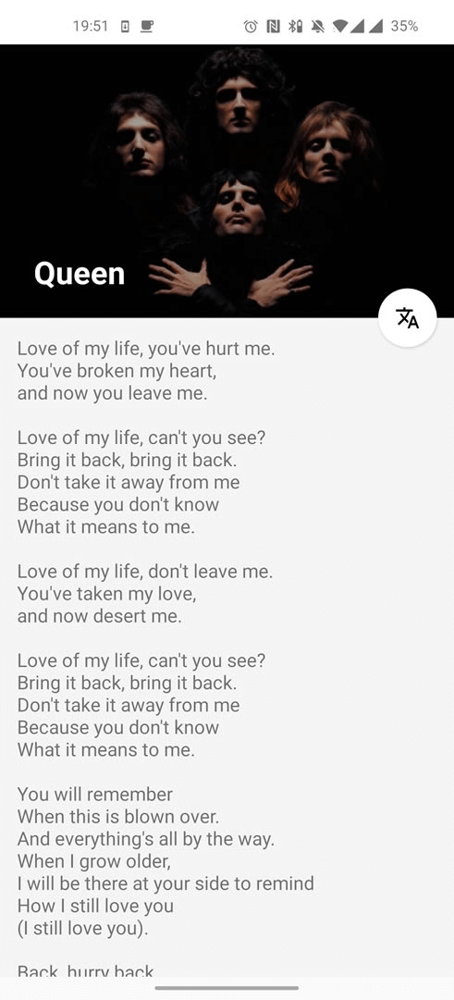

# VagalumeLyrics
### This is an example project using

  - MVI architecture
  - Hilt dependency injection
  - Coroutines, Flow
  - Retrofit
  - Network Observer with LiveData
  - api http://api.vagalume.com.br/docs/

</img>
</img>
</img>
</img>
</img>
</img>
